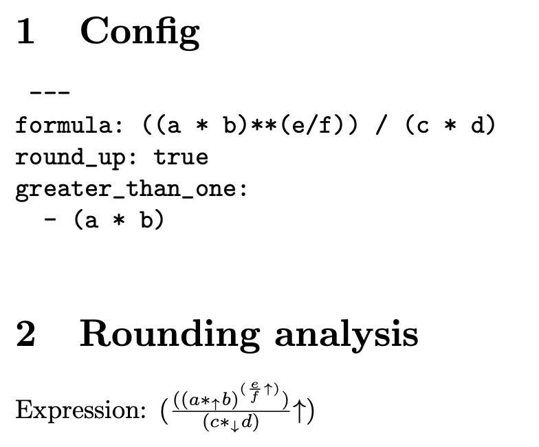

# roundme

`roundme` is a human-assisted rounding analyzer. It helps its operator determine whether an arithmetic operation should round up or down.

## Features

- Recommends whether an arithmetic operation needs to round up or down
- Generates LaTeX-based reports in PDF

## Rules

`rounding()` is the expected rounding direction for the result (up or down)

- `A + B => rounding(A), rounding(B)` (addition does not change the rounding direction)
- `A - B => rounding(A), ! rounding(B)` (the rounding direction of the substracted element is inverse of the expected rounding)
- `A * B => rounding(A), rounding(B), rounding(*)` (multiplication does not change the rounding direction)
- `A / B => rounding(A), ! rounding(B), rounding(/)` (the rounding direction of the denominator is the inverse of the expected rounding)
- `A ** B`
  - `If A>=1 => rounding(A), rounding(B)`
  - `If A<1 => rounding(A), ! rounding(B)` (if A is below 1, the rounding direction of the exponent is the inverse of the expected rounding)

## How to use

- Run `roundme init` to generate a default configuration file.
- Run `roundme config` to generate user configuration file.
- Run `roundme analyze` to analyze the configuration file
- Run `roundme pdf` to generate a PDF (require `latexmk`)

Running `roundme pdf` on the default configuration will generate the following:


### Configuration

`roundme` relies on a configuration file:

```yaml
formula: a * b / c 
round_up: true
less_than_one: ["a * b"] # optional
greater_than_one: ["c"] # optional
```

- `formula` contains the formula to be analyze
- `round_up` determines if the result of the formula should round up or down
- `less_than_one` is used for the `**` [rules](#rules) *(raw string comparison and sensible to space)*
- `greater_than_one` is used for the `**` [rules](#rules) *(raw string comparison and sensible to space)*

See the [balancer V2](./examples/balancer/README.md) example.

## Install

Install with

```bash
cargo install roundme
```

To install the latest GitHub version

```bash
git clone git@github.com:crytic/roundme.git
cd roundme
cargo install --path .
```
